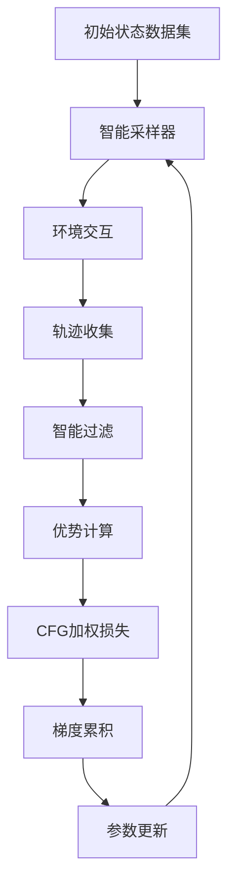

# PI0-RIPT 项目完整状态报告与路线图

## 📋 项目概述

### 项目目标
本项目旨在实现完整的 **PI0-RIPT** (Reinforcement Learning with Image-based Trajectory Prediction) 强化学习训练框架，基于 Physical Intelligence 的 PI0 Vision-Language-Action 模型，为机器人控制任务提供端到端的强化学习优化能力。

### 核心技术栈
- **基础模型**: PI0 (Vision-Language-Action Flow Model)
- **强化学习框架**: RIPT (自研框架，CFG-style优势加权)
- **环境平台**: LIBERO 机器人操作基准测试
- **实现语言**: Python + PyTorch
- **分布式训练**: 支持多GPU DDP训练

---

## 🎯 当前项目状态 (2025-01-04)

### ✅ 已完成的核心组件

#### 1. PI0 模型基础设施 (100% 完成)
- ✅ **模型转换**: JAX → PyTorch 转换管道完成
  - 位置: `convert_pi0_to_hf_lerobot.py`
  - 功能: 保持归一化统计和权重完整性
- ✅ **推理引擎**: PI0Policy 推理完全可用
  - 位置: `pi0/modeling_pi0.py`
  - 功能: Flow Matching 推理，支持图像+语言+状态输入
- ✅ **环境集成**: LIBERO 环境完全集成
  - 位置: `pi0/ript/env/pi0_libero_runner.py`
  - 功能: 轨迹收集、视频保存、状态归一化

#### 2. RIPT 强化学习核心算法 (90% 完成)
- ✅ **CFG 适配器**: PI0_CFG_Adapter 实现
  - 位置: `pi0/ript/algos/rl_optimizers/pi0_cfg_interface.py`
  - 功能: 将 episode 数据转换为 PI0 训练格式
- ✅ **优势计算**: Leave-One-Out 基线算法
  - 功能: CFG-style 优势加权损失计算
- ✅ **智能采样**: SmartSampler 和初始状态管理
  - 功能: 过滤全0/全1结果，多样化状态采样
- ✅ **梯度累积**: 批处理训练机制
  - 功能: 内存高效的大批次训练

#### 3. 渐进式开发脚本 (已完成 8/8 阶段)
```
1. 1_e2e_inference.py          ✅ 端到端推理验证
2. 2_test_pi0_on_libero.py     ✅ LIBERO 环境测试
3. 4_simple_train_ript.py      ✅ 简单 RIPT 训练
4. 5_simple_train_with_runner.py ✅ Runner 集成
5. 6_simple_train_direct_runner.py ✅ 直接 Runner 调用
6. 7_train_with_rl_core.py     ✅ 核心 RL 训练循环
7. 8_train_with_epochs.py      ✅ 智能采样和批处理
8. pi0/ript/scripts/train_ript_pi0.py ✅ 生产级训练脚本
```

### 🔧 当前架构状态

#### 核心训练流程


#### 关键文件结构
```
pi0/
├── modeling_pi0.py              # PI0 模型核心
├── paligemma_with_expert.py     # Vision-Language 骨干
└── ript/
    ├── scripts/
    │   └── train_ript_pi0.py    # 🎯 主训练脚本
    ├── algos/rl_optimizers/
    │   ├── pi0_cfg_interface.py      # CFG 适配器
    │   ├── rl_optimizer_pi0_cfg.py   # RL 优化器
    │   └── rollout_generator.py      # 轨迹生成器
    ├── env/
    │   └── pi0_libero_runner.py      # 环境运行器
    └── config/
        ├── train_pi0_cfg_rl.yaml     # 完整训练配置
        └── debug_train_pi0.yaml      # 调试配置
```

---

## 🚧 当前已知问题与挑战

### 🔴 高优先级问题

#### 1. 智能采样完整性 (刚发现)
- **问题**: 虽然实现了智能采样框架，但当前由于 PI0 模型性能过好，所有轨迹都是 100% 成功率
- **影响**: 无法验证智能过滤机制是否正常工作
- **状态**: 需要使用更困难的任务或降级模型来测试

#### 2. 质量差异调试 (部分解决)
- **问题**: RIPT 训练与参考实现存在 5-11cm 的动作输出差异
- **状态**: 已实现详细的调试基础设施，根本原因定位中
- **位置**: `RIPT_QUALITY_DEBUG_GUIDE.md` 包含完整调试方案

#### 3. 分布式训练稳定性
- **问题**: 多GPU 训练存在死锁和内存问题
- **状态**: 已实现基础解决方案，需要大规模测试验证

### 🟡 中优先级问题

#### 1. 内存优化
- **问题**: 大模型训练内存使用过高
- **当前方案**: 梯度检查点、混合精度训练、异步保存

#### 2. 配置管理
- **问题**: 配置文件复杂，参数调优困难
- **需要**: 更好的超参数搜索和配置验证

---

## 🗺️ 完整开发路线图

### Phase 1: 核心训练能力完善 (当前阶段) - 预计 2-3 周

#### 1.1 智能采样验证和优化
**目标**: 确保 RIPT 智能采样完全可用
- [ ] **任务多样化**: 添加更困难的 LIBERO 任务测试智能过滤
- [ ] **采样策略优化**: 实现更精细的初始状态选择策略
- [ ] **性能指标**: 添加采样效率和质量指标
- **预计时间**: 3-5 天
- **负责人**: 待分配
- **验收标准**: 能在混合成功率场景下正确过滤和采样

#### 1.2 质量差异完全解决
**目标**: 消除 RIPT 与参考实现的质量差异
- [ ] **根因分析**: 使用现有调试工具定位差异来源
- [ ] **修复实现**: 修复发现的实现差异
- [ ] **验证测试**: 确保修复后性能对等
- **预计时间**: 5-7 天
- **负责人**: 待分配
- **验收标准**: 动作输出差异 < 1cm，性能指标一致

#### 1.3 分布式训练优化
**目标**: 实现稳定可靠的多GPU训练
- [ ] **死锁修复**: 解决分布式同步死锁问题
- [ ] **内存优化**: 实现ZeRO优化器状态分片
- [ ] **容错机制**: 添加训练中断恢复机制
- **预计时间**: 4-6 天
- **负责人**: 待分配
- **验收标准**: 8GPU 连续训练 24 小时无故障

### Phase 2: 高级功能和性能优化 - 预计 3-4 周

#### 2.1 超参数优化系统
- [ ] **自动调优**: 集成 Optuna 或 Ray Tune
- [ ] **配置验证**: 自动配置合理性检查
- [ ] **实验管理**: 完整的实验跟踪和对比系统

#### 2.2 模型优化技术
- [ ] **量化训练**: INT8/FP16 混合精度优化
- [ ] **模型剪枝**: 移除冗余参数减少内存
- [ ] **知识蒸馏**: 训练更小的学生模型

#### 2.3 环境扩展
- [ ] **多环境支持**: 扩展到 RLBench、ManipulaTHOR
- [ ] **现实环境**: 真实机器人平台集成
- [ ] **仿真加速**: GPU 加速仿真集成

### Phase 3: 生产部署和工具链 - 预计 2-3 周

#### 3.1 部署基础设施
- [ ] **容器化**: Docker/Kubernetes 部署方案
- [ ] **模型服务**: 推理 API 服务部署
- [ ] **监控告警**: 训练和推理监控系统

#### 3.2 用户友好工具
- [ ] **Web Dashboard**: 训练进度可视化界面
- [ ] **CLI 工具**: 一键训练、推理、评估命令
- [ ] **文档完善**: API 文档、教程、最佳实践

---

## 🎯 接下来的具体任务 (优先级排序)

### 🔥 立即需要处理 (本周)

#### 1. 修复智能采样测试 (最高优先级)
```bash
# 当前问题: 由于模型性能太好，无法测试智能过滤
# 解决方案选项:
# A. 使用更困难的 LIBERO 任务 (推荐)
# B. 人工注入噪声降低成功率
# C. 使用部分训练的模型

# 具体任务:
cd /zhaohan/ZJH/openpi_pytorch
python 8_train_with_epochs.py --task_id 5 --training_iterations 2  # 尝试更难任务
```

#### 2. 完成质量差异调试
```bash
# 使用现有调试基础设施定位问题
python 2_test_pi0_on_libero.py  # 生成参考数据
python pi0/ript/scripts/train_ript_pi0.py --config_path pi0/ript/config/debug_train_pi0.yaml  # 生成RIPT数据
# 对比调试输出找出差异点
```

### 📅 短期目标 (2 周内)

#### 1. 分布式训练验证
```bash
# 测试多GPU训练稳定性
CUDA_VISIBLE_DEVICES=0,1 torchrun --nproc_per_node=2 \
    pi0/ript/scripts/train_ript_pi0.py --config_path pi0/ript/config/train_pi0_cfg_rl.yaml
```

#### 2. 性能基准测试
- [ ] 建立完整的性能指标体系
- [ ] 与原始 PI0 性能对比
- [ ] 训练收敛速度分析

### 📈 中期目标 (1 个月内)

#### 1. 端到端训练流程验证
- [ ] 从随机初始化训练到收敛的完整流程
- [ ] 在多个 LIBERO 任务上验证泛化能力
- [ ] 与其他 VLA 模型性能对比

#### 2. 工具链完善
- [ ] 自动化测试套件
- [ ] 性能监控面板
- [ ] 实验配置管理系统

---

## 📊 技术债务和优化机会

### 代码质量
- [ ] **单元测试**: 核心组件缺少测试覆盖
- [ ] **类型注解**: 不完整的类型提示
- [ ] **文档字符串**: API 文档不完整

### 性能优化
- [ ] **内存使用**: 优化 episode 数据存储
- [ ] **计算效率**: 批处理操作优化
- [ ] **I/O 优化**: 异步数据加载

### 可维护性
- [ ] **配置系统**: 统一配置管理
- [ ] **日志系统**: 结构化日志记录
- [ ] **错误处理**: 更好的异常处理和恢复

### Stage 11 性能优化
- [ ] **并行环境内存管理**: 进一步优化GPU内存使用
- [ ] **多任务负载均衡**: 智能任务分配和资源管理
- [ ] **训练效率优化**: 进一步提高并行训练效果

---

## 🛠️ 开发环境设置

### 依赖安装
```bash
pip install -r requirements.txt
# 主要依赖: torch, transformers, hydra-core, robosuite, wandb
```

### 关键配置文件
```bash
# 训练配置
pi0/ript/config/train_pi0_cfg_rl.yaml      # 完整训练
pi0/ript/config/debug_train_pi0.yaml       # 调试训练

# 模型路径
checkpoints/pi0_libero_pytorch/            # PI0 PyTorch 模型
lerobot_dataset/norm_stats.json           # 归一化参数
```

### 常用命令
```bash
# 基础推理测试
python 1_e2e_inference.py

# LIBERO 环境测试  
python 2_test_pi0_on_libero.py

# 完整 RIPT 训练
python pi0/ript/scripts/train_ript_pi0.py --config_path pi0/ript/config/train_pi0_cfg_rl.yaml

# 智能采样测试
python 8_train_with_epochs.py --training_iterations 2 --debug_sampling true
```

---

## 📚 相关文档和资源

### 项目文档
- `CLAUDE.md` - 完整项目文档和使用指南
- `RIPT_MIGRATION_PROGRESS.md` - RIPT 迁移进度
- `RIPT_QUALITY_DEBUG_GUIDE.md` - 质量调试详细指南
- `COMPLETE_RL_TRAINING_PLAN.md` - 完整 RL 训练计划

### 技术参考
- [PI0 论文](https://www.physicalintelligence.company/download/pi0.pdf)
- [LIBERO 基准](https://github.com/Lifelong-Robot-Learning/LIBERO)
- [LeRobot 框架](https://github.com/huggingface/lerobot)

### 调试和分析工具
- `analyze_*.py` - 各种性能分析脚本
- `test_*.py` - 组件测试脚本
- `debug_*` 目录 - 调试输出和临时文件

---

## 🤝 项目移交指南

### 新开发者入门步骤

1. **环境搭建** (第1天)
   ```bash
   git clone [项目仓库]
   cd openpi_pytorch
   pip install -r requirements.txt
   python 1_e2e_inference.py  # 验证基础功能
   ```

2. **理解架构** (第2-3天)
   - 阅读 `CLAUDE.md` 了解项目全貌
   - 运行 `2_test_pi0_on_libero.py` 理解 PI0-LIBERO 集成
   - 研究 `8_train_with_epochs.py` 理解 RIPT 训练逻辑

3. **调试技能** (第4-5天)  
   - 学习使用 `RIPT_QUALITY_DEBUG_GUIDE.md`
   - 运行调试脚本理解质量差异问题
   - 熟悉分布式训练调试方法

4. **开始开发** (第2周)
   - 从修复智能采样测试开始
   - 逐步承担更复杂的模块

### 关键联系人和资源
- **原开发者**: [待填写联系方式]
- **技术文档**: 项目根目录下所有 `.md` 文件
- **问题跟踪**: [待建立 issue tracker]

---

## 📞 支持和联系

### 获得帮助
1. **查阅文档**: 首先查看项目 `.md` 文档
2. **运行测试**: 使用现有测试脚本验证问题
3. **调试工具**: 利用完整的调试基础设施
4. **社区资源**: LIBERO、LeRobot 官方文档

### 贡献指南
1. **代码风格**: 遵循现有代码风格
2. **测试要求**: 新功能需要添加测试
3. **文档更新**: 修改需要更新相关文档
4. **性能验证**: 确保不降低现有性能

---

**最后更新**: 2025-01-04  
**项目状态**: 核心功能已完成，正在优化和完善阶段  
**下一里程碑**: 智能采样完全验证 + 质量差异完全解决 (预计 2 周内)